#Shader

###Shader프로그래밍 연습
------------------------

###1. BasicFramework

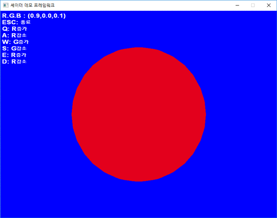

---

###2. TextureMapping

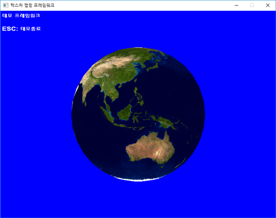

---

###3. Lighting

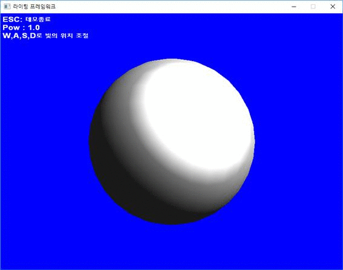

---

###4. SpecularMapping

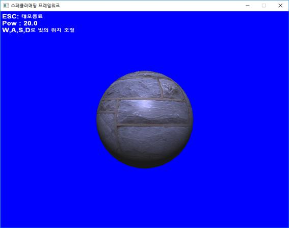

---

###5. ToonShader

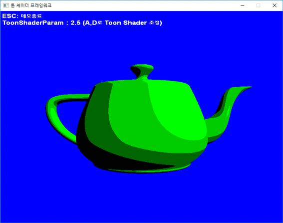

---

###6. NormalMapping

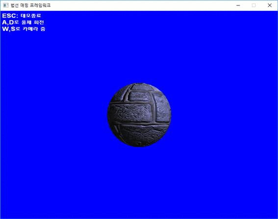

---

###7. EnvironmentMapping

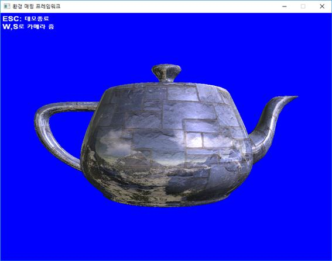

---

###8. UVAnimation

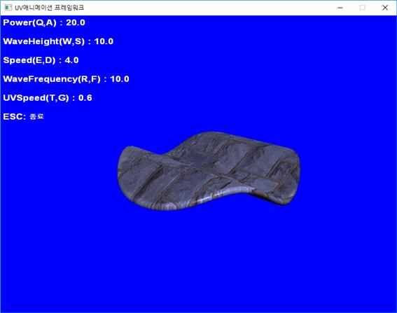

---

###9. ShadowMapping

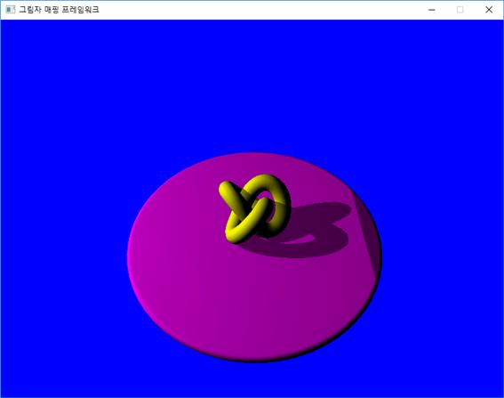

---

###10. ColorConversion

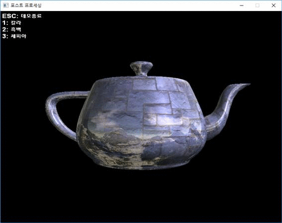

---

###11. EdgeDetection

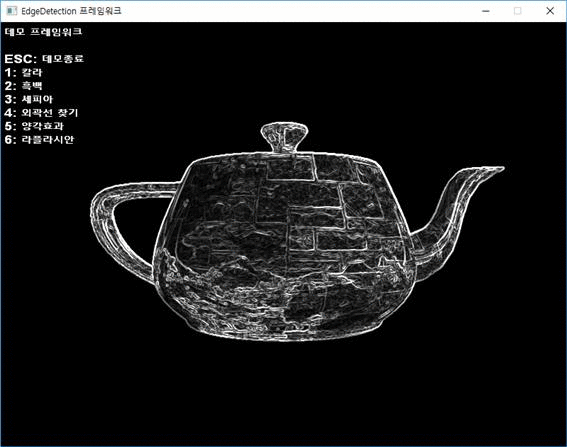

---
